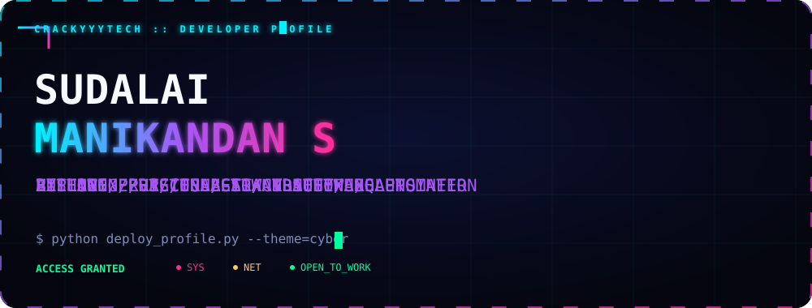
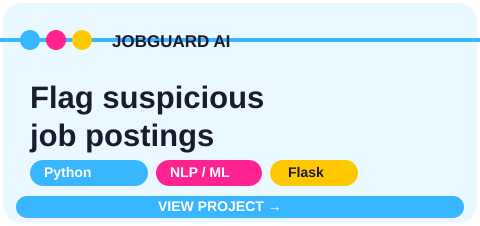
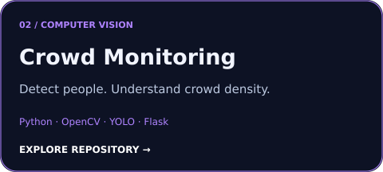
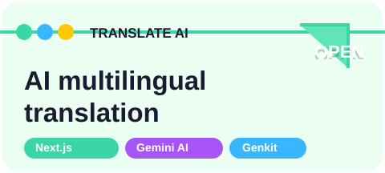
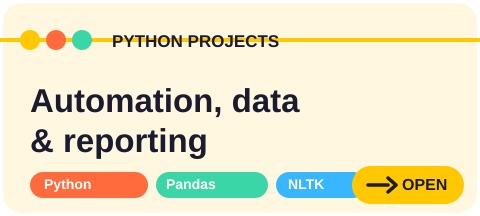
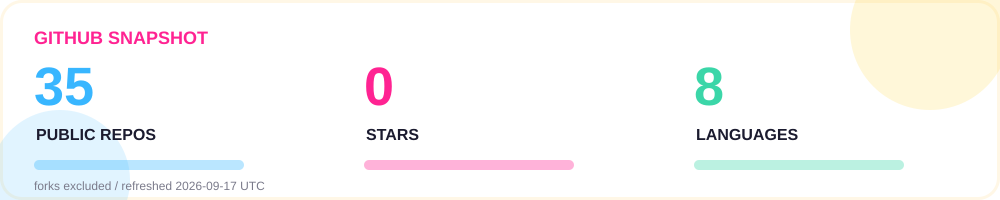

<a id="top"></a>



<p align="center">
  <a href="https://portfolio-crackyyytechs-projects.vercel.app/"></a>
  <a href="https://www.linkedin.com/in/crackyyy-tech/"></a>
  <a href="mailto:crackyyy.tech@gmail.com"></a>
  <a href="https://github.com/crackyyytech?tab=repositories"></a>
</p>

<p align="center"><a href="#about">[ ABOUT ]</a> · <a href="#projects">[ PROJECTS ]</a> · <a href="#stack">[ STACK ]</a> · <a href="#experience">[ LOG ]</a> · <a href="#activity">[ ACTIVITY ]</a> · <a href="#connect">[ CONNECT ]</a></p>

---

<a id="about"></a>
## `// ABOUT`

```diff
+ MODULE   : SUDALAI MANIKANDAN S
+ LOCATION : TENKASI, TAMIL NADU, INDIA
+ ROLE     : SOFTWARE DEVELOPER
+ FOCUS    : BUSINESS APPS / REST APIs / AI FEATURES
+ STACK    : PYTHON / REACT / PHP / VB.NET / SQL
```

I build **business applications, REST APIs and AI-enabled features**, with hands-on work across Python, React, PHP, VB.NET and SQL databases. My work spans **billing and inventory**, **computer vision**, **language tools**, and **automation** — from application logic and database troubleshooting to testing and VPS deployment.

> **OPEN_TO:** AI Engineer · Python Developer · Full-Stack Developer

---

<a id="projects"></a>
## `// EXPLORE PROJECTS`

<p>
<a href="https://github.com/crackyyytech/fake_job_detect"></a>
<a href="https://github.com/crackyyytech/crowd_monitering"></a>
</p>

<p>
<a href="https://github.com/crackyyytech/translate-ai"></a>
<a href="https://github.com/crackyyytech/Python_Internship"></a>
</p>

| ID | PROJECT | SIGNAL | REPO |
| --- | --- | --- | --- |
| **01** | JobGuard AI | NLP classification, risk scoring, API + analytics | [open_repo](https://github.com/crackyyytech/fake_job_detect) |
| **02** | Crowd Monitoring | Video people detection, crowd analysis, reporting | [open_repo](https://github.com/crackyyytech/crowd_monitering) |
| **03** | Translate AI | Next.js + Gemini/Genkit translation integration | [open_repo](https://github.com/crackyyytech/translate-ai) |
| **04** | Python Internship | Python project work from my internship | [browse_code](https://github.com/crackyyytech/Python_Internship) |

<details>
<summary><b>MORE / billing, inventory and language workflows</b></summary>

**Tea Shop Billing & Inventory App** — Flutter application covering invoicing, stock management, automatic stock deduction, sales reporting, user administration and thermal-printer workflows.

**Business translation workflow** — Python/Flask integrations covering speech-to-text, Tamil text normalization, translation APIs and PDF reports. Described separately from the Next.js Translate AI repository above.

[Ask me about these projects](mailto:crackyyy.tech@gmail.com?subject=Project%20discussion)

</details>

---

<a id="stack"></a>
## `// TOOLKIT`

**Languages**

[](https://github.com/search?q=topic%3Apython+user%3Acrackyyytech&type=repositories) [](https://github.com/search?q=topic%3Ajavascript+user%3Acrackyyytech&type=repositories) [](https://github.com/crackyyytech?tab=repositories) [](https://github.com/crackyyytech?tab=repositories) [](https://github.com/crackyyytech?tab=repositories)

**Web & mobile**

[](https://github.com/search?q=topic%3Areact+user%3Acrackyyytech&type=repositories) [](https://github.com/crackyyytech?tab=repositories) [](https://github.com/crackyyytech?tab=repositories) [](https://github.com/crackyyytech?tab=repositories) [](https://github.com/crackyyytech?tab=repositories) [](https://github.com/crackyyytech?tab=repositories) [](https://github.com/crackyyytech?tab=repositories)

**AI & data**

[](https://github.com/crackyyytech?tab=repositories) [](https://github.com/crackyyytech?tab=repositories) [](https://github.com/crackyyytech?tab=repositories) [](https://github.com/crackyyytech?tab=repositories) [](https://github.com/crackyyytech?tab=repositories) [](https://github.com/crackyyytech?tab=repositories)

**Databases & delivery**

[](https://github.com/crackyyytech?tab=repositories) [](https://github.com/crackyyytech?tab=repositories) [](https://github.com/crackyyytech?tab=repositories) [](https://github.com/crackyyytech?tab=repositories) [](https://github.com/crackyyytech?tab=repositories) [](https://github.com/crackyyytech?tab=repositories) [](https://github.com/crackyyytech?tab=repositories)

---

<a id="experience"></a>
## `// CAREER LOG`

**> 2026-FEB — Software Developer, VISTAWIN SOLUTION (Tenkasi, Tamil Nadu)**

- Build and maintain business applications using PHP, MySQL, React.js, VB.NET and SQL Server.
- Develop Python/Flask integrations for speech recognition, Tamil normalization, translation and PDF reporting.
- Investigate application and database defects, test fixes, manage changes with Git and deploy to Linux VPS environments.

**> 2025-JUL — Python Developer Intern, TechNest Intern (Remote)**

- Completed five Python projects covering file analysis, weather visualization, PDF reporting, an NLTK chatbot and spam-email classification.
- Worked with Pandas, Matplotlib, scikit-learn, NLTK, FPDF and REST APIs.

<details>
<summary><b>EDUCATION / learning nodes</b></summary>

**Computer Science and Engineering studies · Trichy Engineering College · 2022–2026**

- Career Essentials in Generative AI — Microsoft and LinkedIn Learning, August 2024.
- Python Fundamentals for Beginners — Great Learning Academy, March 2024.
- Effective Leadership — HP LIFE, July 2025.

</details>

---

<a id="activity"></a>
## `// GH_ACTIVITY`

[](https://github.com/crackyyytech?tab=repositories)

<p align="center">
  <a href="https://github.com/crackyyytech?tab=repositories"></a>
  <a href="https://github.com/crackyyytech?tab=repositories"></a>
  <a href="https://github.com/crackyyytech?tab=repositories"></a>
  <a href="https://github.com/crackyyytech?tab=repositories"></a>
</p>

[Browse repositories](https://github.com/crackyyytech?tab=repositories) · [View contribution history](https://github.com/crackyyytech?tab=overview)

---

<a id="connect"></a>
## `// TRANSMIT`

```
$ connect --via github.com/crackyyytech
$ email     crackyyy.tech@gmail.com
$ linkedin  linkedin.com/in/crackyyy-tech
$ status    OPEN FOR COLLAB
```

Have an AI feature, business application or automation problem in mind? Send the problem, expected outcome and timeline.

**[Discuss a project](mailto:crackyyy.tech@gmail.com?subject=Project%20discussion)** · **[Connect on LinkedIn](https://www.linkedin.com/in/crackyyy-tech/)** · **[Explore my portfolio](https://portfolio-crackyyytechs-projects.vercel.app/)**

---

[↑ Back to top](#top)